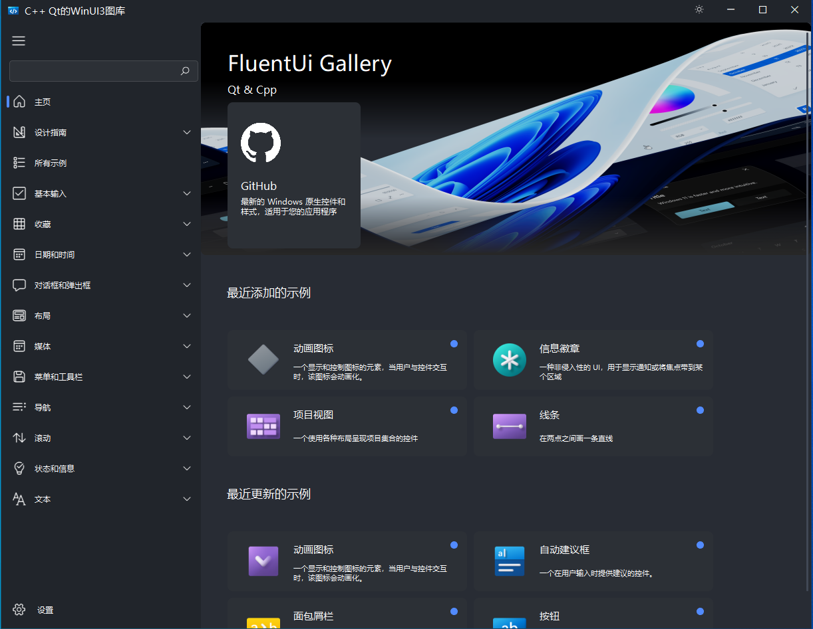

<h1 align="center">
  Cpp FluentUI 
</h1>

<p align="center">
  一个基于 Qt C++ 的 Fluent Design 风格组件库
</p>

<p align="center">
简体中文 | <a href="README.md">English</a>
</p>

<div align=center>
  
</div>

## 特性

+ Fluent Design 风格的 Qt C++ 控件
+ 支持明暗主题切换
+ 国际化支持（i18n）：中文（zh-CN）、英文（en-US）
+ 跨平台：Windows、Linux、macOS
+ 200+ 开箱即用的控件
+ Gallery 示例应用，附带代码示例

## 环境要求

+ CMake >= 3.20
+ Qt 6.x（已测试 Qt 6.5.1、6.7.1、6.8.3、6.9.0）或 Qt 5.x
+ C++17 编译器
+ **Windows**：Visual Studio 2022
+ **Linux**：GCC
+ **macOS**：Clang

> 需要的 Qt 模块：Core、Widgets、Svg、Charts、Core5Compat、Multimedia、ShaderTools、ImageFormats、Speech、3D、SCXML

## 快速开始

### 使用 Visual Studio 2022 构建

1. 克隆仓库：

   ```shell
   git clone https://github.com/mowangshuying/FluentUI.git
   ```

2. 使用 Visual Studio 2022 打开 `FluentUI.sln`。

3. 编译解决方案。

4. 将 **Gallery** 设置为启动项目并运行。

### 使用 Qt Creator 构建

1. 克隆仓库：

   ```shell
   git clone https://github.com/mowangshuying/FluentUI.git
   ```

2. 使用 Qt Creator 打开 `CMakeLists.txt`。

3. 编译项目。

### 使用 CMake 命令行构建

1. 克隆仓库：

   ```shell
   git clone https://github.com/mowangshuying/FluentUI.git
   ```

2. 使用 Ninja 构建（推荐）：

   ```shell
   mkdir build && cd build
   cmake -DCMAKE_PREFIX_PATH=/path/to/Qt -GNinja ..
   cmake --build .
   ```

### CMake 选项

| 选项 | 默认值 | 说明 |
|------|--------|------|
| `USE_QRC` | `TRUE` | 使用 Qt 资源文件（qrc）构建 |
| `BUILD_GALLERY` | `TRUE` | 构建 Gallery 示例应用 |
| `BUILD_ICONTOOL` | `FALSE` | 构建图标工具 |

## 第三方库

+ [framelesshelper](https://github.com/nicehash/framelesshelper) - 无边框窗口辅助库
+ [Qt-Advanced-Docking-System](https://github.com/nicehash/framelesshelper) - 高级停靠系统
+ [qscintilla](https://www.riverbankcomputing.com/software/qscintilla/) - 代码编辑器组件
+ [qrcode](https://github.com/nicehash/framelesshelper) - 二维码生成
+ [cmark](https://github.com/commonmark/cmark) - CommonMark 解析器
+ [qwindowkit](https://github.com/nicehash/framelesshelper) - 窗口工具包

## 文档

详细文档和代码示例请参见 [docs](./docs) 目录。

## 参考

+ [microsoft/WinUI-Gallery](https://github.com/microsoft/WinUI-Gallery) - WinUI 和 Fluent Design System 示例
+ [zhiyiYo/PyQt-Fluent-Widgets](https://github.com/zhiyiYo/PyQt-Fluent-Widgets) - PyQt Fluent Design 控件库
+ [Sepera-okeq/QtFluentWin11](https://github.com/Sepera-okeq/QtFluentWin11) - Windows 11 风格的 Qt Fluent Design
+ [zhuzichu520/FluentUI](https://github.com/zhuzichu520/FluentUI) - QML 版 FluentUI

## 许可证

本项目基于 [GNU 宽松通用公共许可证 v2.1](LICENSE.LGPL)。

## 历史点赞


